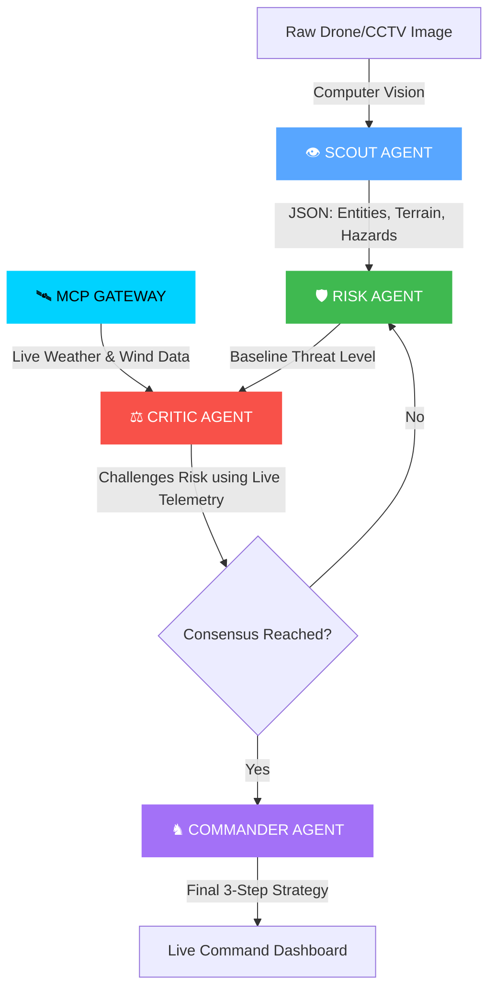
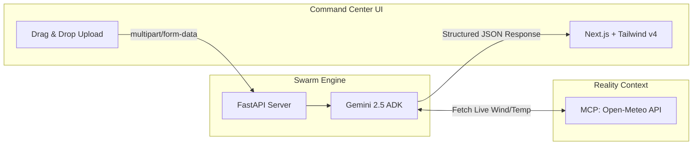

<div align="center">
<h1> AEGIS-SWARM </h1>

### The AI That Refuses to Trust Its First Answer.

## One Image. Four Independent Minds. One Trusted Decision.

</div>
<p align="center">


</p>

<p align="center">


</p>

<p align="center">

</p>

**Autonomous Multi-Agent Visual Intelligence Framework**

> **Most AI systems generate answers. AEGIS-SWARM generates trusted operational decisions.**

AEGIS-SWARM is a custom-built multi-agent orchestration framework for consensus-driven visual intelligence. It was engineered from scratch to provide deterministic control over agent communication, debate, and decision validation rather than relying on a generic orchestration wrapper.

Every recommendation is debated, challenged, and validated against live environmental telemetry before execution.

**One image. Multiple AI minds. One trusted decision.**


---

## 🎥 The Command Center in Action
[](YOUR_YOUTUBE_LINK_HERE)

🚧 Demo video will be published before the Kaggle submission deadline.. 

---

## ⚡ Why AEGIS-SWARM?

> **Traditional AI trusts its first answer.**
>
> **AEGIS-SWARM doesn't.**

AEGIS-SWARM is a **consensus-driven multi-agent orchestration framework** engineered for high-stakes operational intelligence.

Instead of relying on a single model response, every recommendation is:

* 👁️ **Observed** through visual intelligence
* 🧠 **Analyzed** by specialized reasoning agents
* ⚔️ **Challenged** by an independent Critic Agent
* 📡 **Validated** against live environmental context (MCP)
* 🛡️ **Promoted** into an operational decision only after consensus

<div align="center">

## **One Image. Four Independent Minds. One Trusted Decision.**

</div>

 ## 🧠 The 4-Agent Cognitive Pipeline

Instead of relying on a single LLM response, AEGIS-SWARM orchestrates a team of specialized cognitive agents that observe, reason, challenge assumptions, and build consensus before recommending action.



---

## ⚙️ System Architecture & Deployability

Built on a decoupled, production-ready architecture designed for high-stakes environments.



---

## 🏆 Kaggle Rubric Fulfillment

| Concept | Implementation in AEGIS-SWARM | Status |
| --- | --- | --- |
| **Agent / Multi-Agent System (ADK)** | Custom 4-agent topology (Scout, Risk, Critic, Commander) that debates and reaches consensus. | ✅ |
| **MCP Server / Tool Use** | Live HTTP integration fetching real-time environmental telemetry (Wind Speed, Temperature) to inform the Critic Agent. | ✅ |
| **Deployability** | Enterprise-grade decoupled architecture (FastAPI + Next.js). Codebase is ready for Google Cloud Run containerization. | ✅ |
| **Computer Vision / Spatial Reasoning** | The Scout agent does not rely on text prompts; it extracts spatial reality directly from raw pixels. | ✅ |

---

## 🚀 Local Installation Guide

### Prerequisites

* Python 3.10+
* Node.js 18+
* Google Gemini API Key

### 1. Initialize the Swarm Backend (FastAPI)

```bash
cd CRX_Kaggriculture_Core

# Install Core Dependencies
pip install fastapi uvicorn python-multipart requests python-dotenv google-genai

# Configure Environment
echo "GEMINI_API_KEY=your_gemini_api_key_here" > .env

# Ignite the Server
python server.py

```

*Backend runs on `http://localhost:8000*`

### 2. Initialize the Command Center (Next.js)

```bash
cd aegis-frontend

# Install Dependencies
npm install

# Launch Dashboard
npm run dev

```

*Frontend runs on `http://localhost:3000*`

---

*Built with precision and intensity for the Kaggle Intensive Vibe Coding Capstone.*
