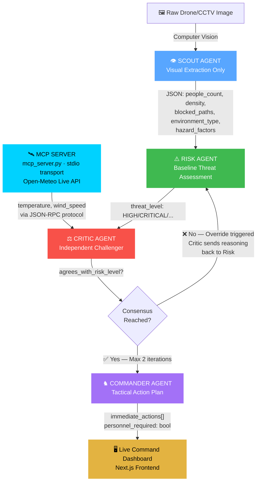
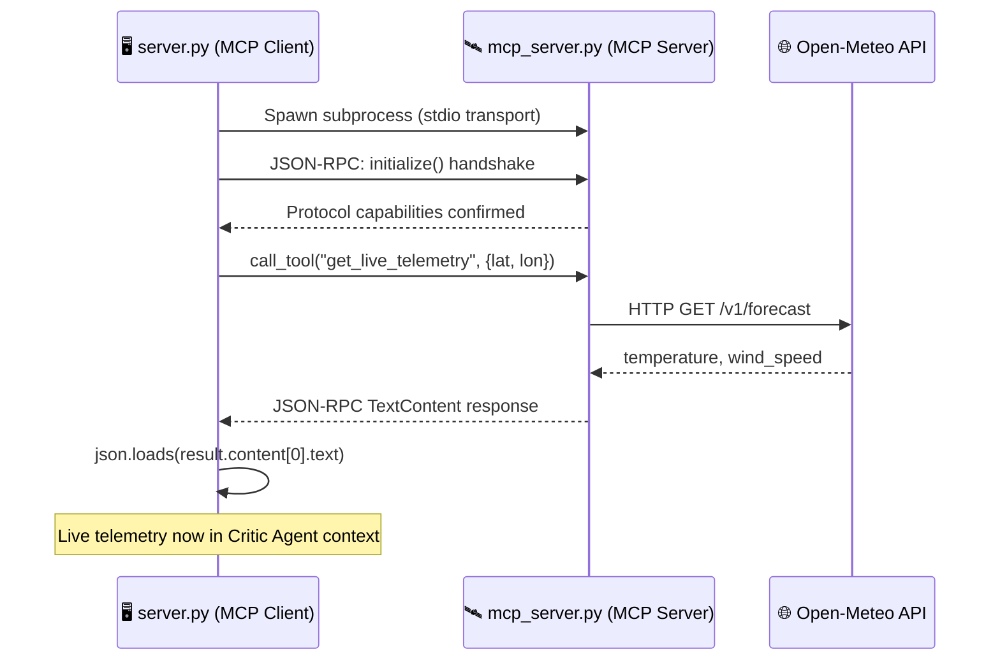
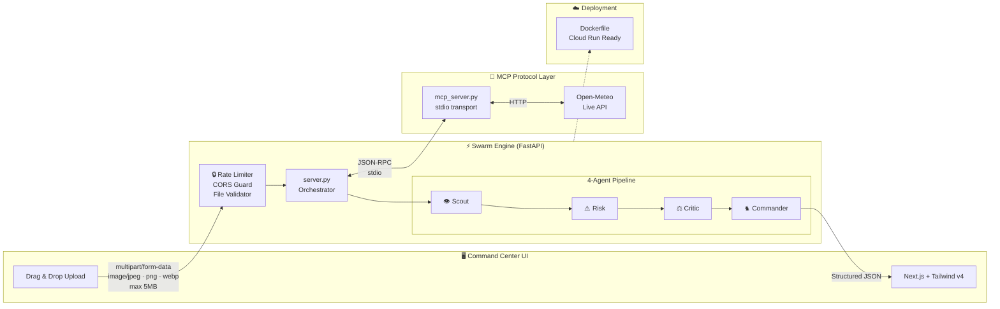

<div align="center">
<h1>⚔️ AEGIS-SWARM</h1>

### The AI That Refuses to Trust Its First Answer.

## One Image. Four Independent Minds. One Trusted Decision.

</div>

<p align="center">

</p>

<p align="center">


</p>

<p align="center">

</p>

> **Most AI systems generate answers. AEGIS-SWARM generates trusted operational decisions.**

AEGIS-SWARM is a custom-built multi-agent orchestration framework for **consensus-driven crowd safety intelligence**. Built for the *Agents for Good* track — because stampedes kill people, and single-model AI is not enough.

Every recommendation is debated, challenged, validated against a **real MCP protocol server** and live environmental telemetry, then — and only then — executed.

---

## 🎥 The Command Center in Action

[](YOUR_YOUTUBE_LINK_HERE)

> 🚧 Video will be live before the Kaggle submission deadline.

---

## ⚡ Why AEGIS-SWARM Exists

> **Crowd crushes are predictable. Kanjuruhan. Itaewon. Astroworld.**
>
> **They happen because no one trusted the data fast enough.**

Current crowd monitoring is reactive — a human watches a screen, notices a problem too late, and acts too slowly. AEGIS-SWARM makes the pipeline autonomous, multi-perspective, and **consensus-gated**: no action is taken until independent AI agents agree.

Instead of one model's first guess, every recommendation is:

- 👁️ **Observed** — Scout extracts spatial facts directly from raw pixels
- 🧠 **Analyzed** — Risk Agent classifies threat level from structured data
- ⚔️ **Challenged** — Critic Agent independently contests the assessment using live telemetry
- 🔁 **Debated** — If Critic disagrees, Risk re-evaluates with Critic's feedback (iterative loop)
- 🛡️ **Promoted** — Commander acts only after consensus is reached

<div align="center">

## **One Image. Four Independent Minds. One Trusted Decision.**

</div>

---

## 🧠 The 4-Agent Cognitive Pipeline



### Agent Roles — Why Each One Exists

| Agent | Role | Why Separate? |
|---|---|---|
| **👁️ Scout** | Visual extraction only — no threat reasoning | Mixing vision + risk in one agent makes reasoning unauditable |
| **⚠️ Risk** | Baseline threat classification (LOW/MEDIUM/HIGH/CRITICAL) | First-pass assessor with no prior assumptions |
| **⚖️ Critic** | Independent challenger using live MCP telemetry | Prevents echo-chamber failure — explicitly prompted to disagree |
| **♞ Commander** | Tactical action plan from consensus-validated data | Acts on Critic's final verdict, not Risk's initial guess |

---

## 📡 The Real MCP Architecture

> **This is not a labeled REST call. This is actual Model Context Protocol.**

Most "MCP integrations" in hackathon projects are just `requests.get()` with "MCP" written in a comment. AEGIS-SWARM implements the real protocol:



**`mcp_server.py`** — Standalone FastMCP server, exposed via `stdio` transport, registered tool `get_live_telemetry()` using official `mcp` Python SDK.

**`server.py`** — Acts as MCP client using `ClientSession` + `stdio_client`, performs protocol handshake via `session.initialize()`, calls tool via `session.call_tool()`.

This means the telemetry provider is **fully decoupled** — swappable, independently deployable, and reusable by any MCP-compatible host.

---

## ⚙️ Full System Architecture



---

## 🔒 Security Architecture

Production-hardened from day one — not bolted on as an afterthought.

| Layer | Implementation | What It Prevents |
|---|---|---|
| **Rate Limiting** | `slowapi` — 10 req/min per IP on `/api/analyze` | DDoS, API quota exhaustion |
| **CORS Restriction** | Explicit allowlist (`localhost:3000`, production URL only) | Cross-origin attacks from arbitrary domains |
| **File Type Validation** | Content-type check: `image/jpeg`, `image/png`, `image/webp` only | Arbitrary file injection into vision agent |
| **File Size Cap** | Hard 5MB limit, rejected before agent pipeline runs | Memory exhaustion attacks |
| **Path Traversal Guard** | `os.path.basename(file.filename)` on every upload | `../../server.py` overwrite attacks |
| **Privacy Cleanup** | `client.files.delete()` after Scout extraction (`finally` block) | Surveillance footage persisting on external servers |
| **API Key Guard** | Fail-fast `ValueError` if `GEMINI_API_KEY` missing | Silent auth failures masking misconfigurations |

---

## 🔁 The Debate Loop — How Consensus Actually Works

Most multi-agent systems are just sequential prompt chains. AEGIS-SWARM implements a **real iterative consensus mechanism**:

```
Iteration 1:
  Risk Agent → "MEDIUM threat. Moderate density in open area."
  Critic Agent → "Disagree. Environment is a stairway. Elevating to HIGH."
  → consensus_reached = False → loop back

Iteration 2 (with Critic's reasoning injected into Risk's context):
  Risk Agent → "HIGH threat. Stairway environment confirmed. Dense crowd."
  Critic Agent → "Agreed."
  → consensus_reached = True → Commander executes
```

- **Max 2 iterations** — prevents infinite cycling
- **Critic feedback is injected** as `critic_override_reasoning` into Risk's next prompt
- **Commander only receives** the final consensus output — never an intermediate draft

---

## 🏆 Kaggle Rubric Fulfillment

| Concept | Implementation | Evidence |
|---|---|---|
| **Multi-Agent System** | 4-agent topology with iterative consensus debate loop | `server.py` — `while iteration < MAX_ITERATIONS` |
| **Real MCP Server** | `mcp_server.py` — FastMCP, `@mcp.tool()`, `stdio` transport, JSON-RPC protocol | `mcp_server.py` + `get_telemetry_via_mcp()` in `server.py` |
| **Deployability** | Dockerfile included, Cloud Run ready, `uvicorn` production config | `Dockerfile` in root |
| **Security Features** | Rate limiting, CORS, file validation, path traversal guard, privacy cleanup | `server.py` security section + `test_main.py` |
| **Computer Vision** | Scout Agent: Gemini vision model extracts structured spatial data from raw pixels | `agents/scout.py` |
| **Testing** | 8 pytest tests covering security, parsing, and edge cases | `test_main.py` |

---

## 🚀 Local Installation

### Prerequisites

- Python 3.10+
- Node.js 18+
- Google Gemini API Key

### 1. Backend — Swarm Engine

```bash
cd CRX_Kaggriculture_Core

# Install all dependencies (includes MCP SDK)
pip install -r requirements.txt

# Configure environment
echo "GEMINI_API_KEY=your_gemini_api_key_here" > .env

# Start the server (MCP server auto-spawns as subprocess)
python server.py
```

> Backend runs at `http://localhost:8000`

### 2. Frontend — Command Dashboard

```bash
cd aegis-frontend

npm install
npm run dev
```

> Frontend runs at `http://localhost:3000`

### 3. Run Tests

```bash
pytest test_main.py -v
```

### 4. Docker Deployment

```bash
# Build the container
docker build -t aegis-swarm .

# Run locally
docker run -p 8000:8000 --env-file .env aegis-swarm
```

### 5. Batch Processing (offline)

```bash
# Drop images into test_images/, reports saved to outputs/
python run_all.py
```

---

## 📁 Project Structure

```
AEGIS-SWARM/
├── agents/
│   ├── scout.py          # Visual extraction + privacy cleanup
│   ├── risk.py           # Baseline threat classification
│   ├── critic.py         # Independent challenger
│   └── commander.py      # Tactical action planner
├── mcp_server.py         # Real MCP server (FastMCP, stdio transport)
├── server.py             # FastAPI orchestrator + MCP client
├── main.py               # CLI runner (local debug)
├── run_all.py            # Batch image processor
├── test_main.py          # 8 pytest security + unit tests
├── Dockerfile            # Production container config
├── requirements.txt      # All dependencies including mcp SDK
└── aegis-frontend/       # Next.js command dashboard
```

---

## 👨‍💻 Developer

**Built by [CODERUDRA-X](https://github.com/CODERUDRA-X)**
*Building the future of AI, Vision Systems, and Defense-Tech.*

<p align="center">


</p>
